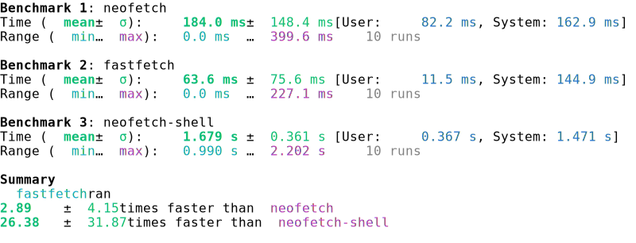
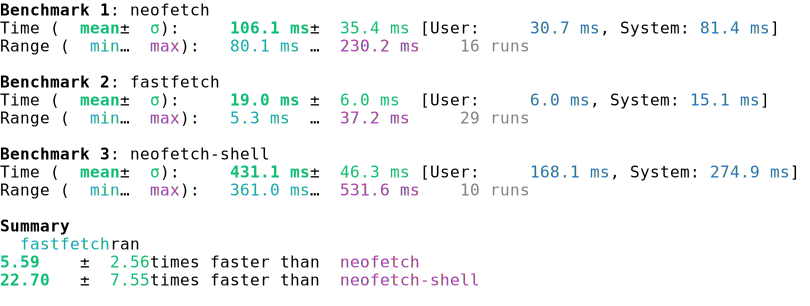

## install

```rs
cargo install neofetch

neofetch
```

### win

<div align="center">
	<a href="https://github.com/ahaoboy/neofetch">
		
	</a>
</div>

### ubuntu

<div align="center">
	<a href="https://github.com/ahaoboy/neofetch">
		
	</a>
</div>

### darwin

<div align="center">
	<a href="https://github.com/ahaoboy/neofetch">
		
	</a>
</div>

### android

<div align="center">
	<a href="https://github.com/ahaoboy/neofetch">
		
	</a>
</div>

## perf

https://github.com/dylanaraps/neofetch


https://github.com/fastfetch-cli/fastfetch


```bash
hyperfine --style=full --shell=fish 'neofetch' 'fastfetch' 'neofetch-shell'
```

### windows
<div align="center">
  
</div>

### ubuntu
<div align="center">
  
</div>

### android
<div align="center">
  
</div>
