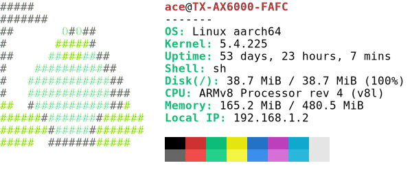

# Neofetch (Rust)

A fast, cross-platform system information tool written in Rust. This is a modern reimplementation of the classic neofetch tool with improved performance, comprehensive error handling, and support for multiple platforms.

[](https://crates.io/crates/neofetch)
[](https://opensource.org/licenses/MIT)

## Features

- 🚀 **Blazing Fast** - Written in Rust for maximum performance
- 🌍 **Cross-Platform** - Supports Windows, Linux, macOS, Android, and OpenWrt
- 🎨 **Beautiful Output** - Colorful ASCII art with system information
- 🔧 **Comprehensive** - Displays CPU, memory, disk, GPU, network, and more
- ⚡ **Async** - Parallel information gathering for speed
- 🛡️ **Robust** - Proper error handling with detailed error messages
- 📦 **Zero Config** - Works out of the box, no configuration needed

## Installation

### From crates.io

```bash
cargo install neofetch
```

### From source

```bash
git clone https://github.com/ahaoboy/neofetch
cd neofetch
cargo build --release
```

The binary will be available at `target/release/neofetch`

## Usage

Simply run:

```bash
neofetch
```

### win

<div align="center">
	<a href="https://github.com/ahaoboy/neofetch">
		
	</a>
</div>

### ubuntu

<div align="center">
	<a href="https://github.com/ahaoboy/neofetch">
		
	</a>
</div>

### darwin

<div align="center">
	<a href="https://github.com/ahaoboy/neofetch">
		
	</a>
</div>

### android

<div align="center">
	<a href="https://github.com/ahaoboy/neofetch">
		
	</a>
</div>

### Linux aarch64

<div align="center">
	<a href="https://github.com/ahaoboy/neofetch">
		
	</a>
</div>

## System Information Displayed

- **Operating System** - Name, version, and architecture
- **Host** - Device manufacturer and model
- **Kernel** - Kernel version
- **Uptime** - System uptime
- **Packages** - Installed packages (dpkg, pacman, snap, scoop, opkg)
- **Shell** - Current shell and version
- **Display** - Resolution and refresh rate
- **Desktop Environment** - DE name
- **Window Manager** - WM name and theme
- **Terminal** - Terminal emulator
- **CPU** - Model, cores, and frequency
- **GPU** - Graphics card information
- **Memory** - RAM usage
- **Disk** - Disk usage for mounted filesystems
- **Battery** - Battery percentage (if available)
- **Network** - Network interfaces and IP addresses
- **Temperature** - System temperature sensors (if available)
- **Locale** - System locale

## Platform Support

| Platform | Status | Notes |
|----------|--------|-------|
| Windows 10/11 | ✅ Full Support | x86, x86_64, ARM64 |
| Linux | ✅ Full Support | Ubuntu, Debian, Arch, Fedora, etc. |
| macOS | ✅ Full Support | Intel and Apple Silicon |
| Android | ✅ Full Support | ARM and ARM64 |
| OpenWrt | ✅ Full Support | Embedded routers |
| FreeBSD | ⚠️ Partial | Basic support |

## Performance

This Rust implementation is significantly faster than the original shell-based neofetch:

```bash
hyperfine --style=full --shell=fish 'neofetch' 'fastfetch' 'neofetch-rust'
```

### windows
<div align="center">
  
</div>

### ubuntu
<div align="center">
  
</div>

### android
<div align="center">
  
</div>


## Building from Source

### Prerequisites

- Rust 1.70 or later
- Cargo (comes with Rust)

### Platform-Specific Requirements

#### Windows
- Visual Studio Build Tools or MinGW-w64
- No additional dependencies required

#### Linux
- GCC or Clang
- Standard development tools (`build-essential` on Debian/Ubuntu)

#### macOS
- Xcode Command Line Tools: `xcode-select --install`

#### Android
- Android NDK
- Cargo NDK: `cargo install cargo-ndk`

### Build Instructions

```bash
# Clone the repository
git clone https://github.com/ahaoboy/neofetch
cd neofetch

# Build in release mode
cargo build --release

# Run
./target/release/neofetch
```

### Cross-Compilation

#### For Android
```bash
# Add Android targets
rustup target add aarch64-linux-android armv7-linux-androideabi

# Build for ARM64
cargo ndk -t arm64-v8a build --release
```

#### For OpenWrt
```bash
# Add target
rustup target add mips-unknown-linux-musl

# Build
cargo build --release --target mips-unknown-linux-musl
```

## Architecture

The project is organized into several modules:

- **error** - Centralized error handling using thiserror
- **utils** - Reusable utilities for file I/O, process execution, and platform detection
- **platform** - Platform-specific implementations (Windows WMI, Linux /proc, macOS sysctl, Android properties)
- **collectors** - Individual system information collectors (CPU, memory, disk, etc.)
- **display** - Output formatting and ASCII art

## Error Handling

This implementation uses comprehensive error handling with the `thiserror` crate. All operations return `Result` types with detailed error messages, making debugging easier and preventing panics.

```rust
use neofetch::{cpu::get_cpu, Result};

#[tokio::main]
async fn main() -> Result<()> {
    let cpu = get_cpu().await?;
    println!("CPU: {}", cpu);
    Ok(())
}
```

## Contributing

Contributions are welcome! Please feel free to submit a Pull Request. For major changes, please open an issue first to discuss what you would like to change.

### Development Setup

1. Fork the repository
2. Create your feature branch: `git checkout -b feature/amazing-feature`
3. Make your changes
4. Run tests: `cargo test`
5. Run clippy: `cargo clippy`
6. Format code: `cargo fmt`
7. Commit your changes: `git commit -m 'Add amazing feature'`
8. Push to the branch: `git push origin feature/amazing-feature`
9. Open a Pull Request

### Code Style

- Follow Rust naming conventions
- Use English for all code, comments, and documentation
- Add rustdoc comments for public APIs
- Write tests for new functionality
- Ensure code passes `cargo clippy` without warnings

## Troubleshooting

### Windows

**Issue**: WMI queries fail
- **Solution**: Run as Administrator or check Windows Management Instrumentation service is running

**Issue**: Display information not available
- **Solution**: This is expected on Windows Server Core or systems without display drivers

### Linux

**Issue**: Permission denied reading /proc or /sys files
- **Solution**: Some files require root access. Run with `sudo` if needed

**Issue**: Temperature sensors not found
- **Solution**: Install `lm-sensors` package and run `sensors-detect`

### macOS

**Issue**: Temperature information not available
- **Solution**: Install `osx-cpu-temp` via Homebrew: `brew install osx-cpu-temp`

**Issue**: Some system information requires elevated privileges
- **Solution**: Run with `sudo` for complete information

### Android

**Issue**: Some properties not accessible
- **Solution**: Root access may be required for certain system properties

## Comparison with Other Tools

| Feature | neofetch (Rust) | neofetch (Shell) | fastfetch |
|---------|----------------|------------------|-----------|
| Speed | ⚡⚡⚡ | ⚡ | ⚡⚡⚡ |
| Cross-platform | ✅ | ✅ | ✅ |
| Error Handling | ✅ | ❌ | ⚠️ |
| Async | ✅ | ❌ | ✅ |
| Memory Usage | Low | Medium | Low |
| Dependencies | Minimal | Many | Minimal |

## License

This project is licensed under the MIT License - see the [LICENSE](LICENSE) file for details.

## Acknowledgments

- Original [neofetch](https://github.com/dylanaraps/neofetch) by Dylan Araps
- [fastfetch](https://github.com/fastfetch-cli/fastfetch) for inspiration
- The Rust community for excellent tools and libraries

## Links

- [Repository](https://github.com/ahaoboy/neofetch)
- [Crates.io](https://crates.io/crates/neofetch)
- [Documentation](https://docs.rs/neofetch)
- [Issue Tracker](https://github.com/ahaoboy/neofetch/issues)
